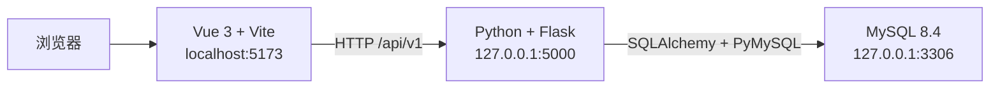

# FA Library 项目说明

## 1. 项目概述

FA Library 是一个用于维护 Failure Analysis（失效分析）案例的前后端分离项目。

系统主要功能包括：

- 展示 FA Case 列表；
- 按关键词搜索 Case；
- 新增、编辑、单条删除和批量删除；
- 分页查询；
- 统计产品分布；
- 统计各项目的 Case 数量；
- 维护 Project、Product、Technology 数据字典；
- 将数据字典选项同步到 Case 新增和编辑表单。

测试用例、执行过程和测试结果记录在根目录的 `测试记录.md`。

当前项目目录：

```text
D:\user\yym\fa\
├── front\      Vue 3 前端
└── back\       Flask 后端
```

## 2. 技术架构



### 前端

- Vue 3
- Vite
- JavaScript
- 原生 CSS

### 后端

- Python
- Flask
- Flask-SQLAlchemy
- Flask-Migrate
- Flask-Cors
- PyMySQL
- python-dotenv

### 数据库

- MySQL Community Server 8.4.9
- 字符集：`utf8mb4`
- 排序规则：`utf8mb4_0900_ai_ci`

## 3. MySQL 环境

MySQL 当前安装信息：

```text
安装目录：D:\MySQL\MySQL Server 8.4
数据目录：D:\MySQL\data
配置文件：D:\MySQL\my.ini
Windows 服务：MySQL84
服务地址：127.0.0.1
服务端口：3306
启动方式：Automatic
```

检查服务状态：

```powershell
Get-Service MySQL84
```

启动和停止服务（需要管理员 PowerShell）：

```powershell
Start-Service MySQL84
Stop-Service MySQL84
```

登录 MySQL：

```powershell
& "D:\MySQL\MySQL Server 8.4\bin\mysql.exe" -u root -p
```

项目数据库和推荐账户：

```text
数据库：fa_library
应用账户：fa_app
```

Flask 应使用 `fa_app` 连接数据库，不应直接使用 `root`。真实密码只能放在后端本机 `.env` 文件中，不得提交到 Git。

## 4. 数据模型

后端当前定义 `fa_cases` 和 `data_dictionary_options` 两张业务表。

| 字段 | 类型 | 说明 |
|---|---|---|
| `id` | BIGINT | 数据库主键，自增 |
| `case_id` | VARCHAR(50) | Case 业务编号，唯一，由后端自动生成 |
| `project` | VARCHAR(100) | 项目名称 |
| `product` | VARCHAR(100) | 产品名称 |
| `technology` | VARCHAR(100) | 技术类型 |
| `fail_type` | VARCHAR(100) | 失效类型，可为空 |
| `fail_model` | VARCHAR(100) | 失效模型 |
| `created_at` | DATETIME | 创建时间 |
| `updated_at` | DATETIME | 更新时间 |

数据表由 Flask-Migrate 创建和维护，不建议同时手工修改表结构。

数据字典表：

| 字段 | 类型 | 说明 |
|---|---|---|
| `id` | BIGINT | 数据库主键，自增 |
| `dictionary_type` | VARCHAR(30) | 字典类型：project、product、technology |
| `value` | VARCHAR(100) | 下拉选项值 |
| `sort_order` | INT | 选项显示顺序 |
| `created_at` | DATETIME | 创建时间 |
| `updated_at` | DATETIME | 更新时间 |

同一字典类型下的选项值具有唯一约束。默认迁移数据为Project1~3、Product1~3和Technology1~3。

## 5. 后端目录结构

```text
back/
├── app/
│   ├── __init__.py
│   ├── config.py
│   ├── extensions.py
│   ├── models/
│   │   ├── case.py
│   │   └── data_dictionary.py
│   ├── routes/
│   │   ├── health.py
│   │   ├── cases.py
│   │   ├── dashboard.py
│   │   └── data_dictionaries.py
│   ├── schemas/
│   │   └── case_schema.py
│   ├── services/
│   │   ├── case_service.py
│   │   └── data_dictionary_service.py
│   └── errors/
│       └── __init__.py
├── tests/
│   ├── conftest.py
│   ├── test_cases.py
│   └── test_data_dictionaries.py
├── migrations/
├── .env.example
├── .gitignore
├── README.md
├── requirements.txt
└── run.py
```

主要职责：

- `config.py`：读取数据库和应用配置；
- `extensions.py`：初始化 SQLAlchemy、Migrate 和 CORS；
- `models/case.py`：定义 `fa_cases` 数据模型；
- `models/data_dictionary.py`：定义数据字典选项模型和唯一约束；
- `routes/cases.py`：Case CRUD 与分页接口；
- `routes/data_dictionaries.py`：数据字典查询和更新接口；
- `routes/dashboard.py`：主页统计接口；
- `routes/health.py`：应用和数据库健康检查；
- `schemas/case_schema.py`：基础请求参数校验；
- `services/case_service.py`：生成 `FA + YYYYMMDD + 001~999` 格式的 Case ID；
- `services/data_dictionary_service.py`：字典类型校验、默认数据初始化、选项标准化和批量替换；
- `errors/__init__.py`：统一处理 HTTP、数据库和未知异常，并执行事务回滚；
- `tests/`：使用 Pytest 和 SQLite 内存数据库执行后端接口自动化测试。

## 6. 后端配置与启动

进入后端目录：

```powershell
cd D:\user\yym\fa\back
```

创建虚拟环境：

```powershell
python -m venv .venv
.\.venv\Scripts\Activate.ps1
```

安装依赖：

```powershell
pip install -r requirements.txt
```

复制环境变量模板：

```powershell
Copy-Item .env.example .env
notepad .env
```

`.env` 示例：

```env
FLASK_APP=run.py
FLASK_DEBUG=true
SECRET_KEY=请替换为随机字符串
DB_HOST=127.0.0.1
DB_PORT=3306
DB_NAME=fa_library
DB_USER=fa_app
DB_PASSWORD=请填写本机数据库密码
```

注意：

- `.env` 已加入 `.gitignore`；
- 不要把真实密码填写到 `.env.example`；
- 密码包含 `@`、`#` 等字符时，后端会自动进行 URL 编码。

首次创建数据表：

```powershell
flask db init
flask db migrate -m "create fa_cases table"
flask db upgrade
```

如果 `migrations` 目录已经存在，不要再次执行 `flask db init`，只需执行：

```powershell
flask db migrate -m "描述本次模型变更"
flask db upgrade
```

当前代码的最新迁移头为`c3a4f5d6e7b8`。更新代码后必须执行`flask db upgrade`，该迁移会创建`data_dictionary_options`表并写入三类默认选项。

启动后端：

```powershell
flask run
```

或：

```powershell
python run.py
```

默认地址：

```text
http://127.0.0.1:5000
```

检查数据库连接：

```text
GET http://127.0.0.1:5000/api/v1/health
```

正常响应：

```json
{
  "code": 0,
  "message": "success",
  "data": {
    "database": "connected"
  }
}
```

运行后端自动化测试：

```powershell
.\.venv\Scripts\python.exe -m pytest -q
```

## 7. API 接口

所有接口使用 `/api/v1` 前缀。

### 7.1 健康检查

```http
GET /api/v1/health
```

### 7.2 Case 分页查询

```http
GET /api/v1/cases?page=1&page_size=10&keyword=Phoenix
```

示例响应：

```json
{
  "code": 0,
  "message": "success",
  "data": {
    "items": [],
    "pagination": {
      "page": 1,
      "page_size": 10,
      "total": 0,
      "total_pages": 0
    }
  }
}
```

### 7.3 Case 详情

```http
GET /api/v1/cases/1
```

### 7.4 新增 Case

```http
POST /api/v1/cases
Content-Type: application/json
```

```json
{
  "project": "Project1",
  "product": "Product1",
  "technology": "Technology1",
  "fail_type": "",
  "fail_model": "Mode A"
}
```

`case_id` 不需要由前端提交，后端会按 `FA + YYYYMMDD + 三位序号` 自动生成，例如 `FA20260810001`。`fail_type` 为非必填字段。

### 7.5 修改 Case

```http
PUT /api/v1/cases/1
Content-Type: application/json
```

请求体字段与新增接口一致。前端请求层只提交`project`、`product`、`technology`、`fail_type`和`fail_model`，不会提交`id`、`case_id`、`created_at`、`updated_at`等只读字段。

### 7.6 删除单条 Case

```http
DELETE /api/v1/cases/1
```

### 7.7 批量删除

```http
POST /api/v1/cases/batch-delete
Content-Type: application/json
```

```json
{
  "ids": [1, 2, 3]
}
```

### 7.8 首页统计

```http
GET /api/v1/dashboard/statistics
```

响应包含：

- `total_cases`：Case 总数；
- `product_distribution`：按产品统计；
- `cases_by_project`：按项目统计。

### 7.9 Case 默认选项

```http
GET /api/v1/cases/options
```

返回 Project、Product 和 Technology 的当前下拉选项。数据来自`data_dictionary_options`表，不再使用后端硬编码常量。

### 7.10 下一个 Case ID 预览

```http
GET /api/v1/cases/next-case-id
```

返回按当天数据计算出的下一个 Case ID。最终编号仍以新增接口成功保存时返回的编号为准。

### 7.11 查询数据字典

```http
GET /api/v1/data-dictionaries
```

响应按`project`、`product`、`technology`分组，每个选项包含`id`、`dictionary_type`、`value`和`sort_order`。

### 7.12 更新数据字典

```http
PUT /api/v1/data-dictionaries/project
Content-Type: application/json
```

```json
{
  "options": ["Phoenix", "Orion", "Atlas"]
}
```

路径中的字典类型仅允许`project`、`product`、`technology`。接口会校验空值、长度和重复选项，并以请求顺序保存。提交空数组可清空该类型的全部选项。

## 8. 前端目录与启动

前端目录：

```text
D:\user\yym\fa\front
```

主要文件：

```text
front/
├── src/
│   ├── api/
│   │   ├── request.js
│   │   ├── cases.js
│   │   ├── dashboard.js
│   │   └── dataDictionaries.js
│   ├── components/
│   │   ├── AppHeader.vue
│   │   ├── AppSidebar.vue
│   │   ├── DashboardCharts.vue
│   │   ├── CaseToolbar.vue
│   │   ├── CaseTable.vue
│   │   ├── CaseCreateView.vue
│   │   ├── CaseDetailView.vue
│   │   ├── DataDictionaryView.vue
│   │   └── ConfirmDialog.vue
│   ├── App.vue
│   ├── main.js
│   └── style.css
├── index.html
├── package.json
├── pnpm-lock.yaml
└── vite.config.js
```

使用本机已配置好的 Node.js 时：

```powershell
cd D:\user\yym\fa\front
pnpm install
pnpm dev
```

如果使用 Codex 附带的 Node.js，需要先在当前 PowerShell 会话设置路径：

```powershell
$env:Path = "C:\Users\73136\.cache\codex-runtimes\codex-primary-runtime\dependencies\node\bin;C:\Users\73136\.cache\codex-runtimes\codex-primary-runtime\dependencies\bin\fallback;$env:Path"

cd D:\user\yym\fa\front
pnpm install
pnpm dev
```

默认地址：

```text
http://localhost:5173
```

生产构建：

```powershell
pnpm build
```

## 9. 前后端联调配置

开发环境已经配置为由 Vite 将 `/api` 请求代理到 Flask。

在 `vite.config.js` 中加入：

```js
export default defineConfig({
  plugins: [vue()],
  server: {
    proxy: {
      '/api': {
        target: 'http://127.0.0.1:5000',
        changeOrigin: true
      }
    }
  }
})
```

前端通过 `src/api` 目录中的请求模块统一使用相对地址调用后端：

```js
getCases({ page: 1, pageSize: 10, keyword: '' })
```

不要在 Vue 代码中保存 MySQL 地址、账户或密码，也不要让浏览器直接连接 MySQL。

当前前端 API 模块：

```text
front/src/
├── api/
│   ├── request.js       统一处理 Fetch、JSON 和接口错误
│   ├── cases.js         Case 查询、新增、修改和删除
│   ├── dashboard.js     首页统计数据
│   └── dataDictionaries.js 数据字典查询和更新
├── components/          页面独立组件
└── App.vue              状态、接口调用和组件编排
```

当前已经实现：

- 页面加载时从 `/api/v1/cases` 获取真实列表；
- 搜索关键词变更后进行防抖查询；
- 翻页时由后端执行分页；
- 新增页面调用 Flask 接口保存数据，Case ID 由后端最终生成；
- 点击 Case ID 进入只读详情页，右上角可切换编辑状态；
- 点击 Operation 编辑图标进入与新增页相同布局的编辑页面；
- Fail Type 前后端均为非必填；
- 单条删除和批量删除操作 MySQL 数据；
- 删除操作使用统一站内确认弹窗，不使用浏览器原生提示；
- 左侧菜单保留Library > FA Library，并增加System Management > Data Dictionary；
- Data Dictionary以表格展示三类字典，支持新增、编辑、逐项移除和清空；
- 字典保存后自动刷新Case表单下拉选项；
- 产品分布和项目柱状图读取 `/api/v1/dashboard/statistics`；
- Product数量较多时图例在卡片内部滚动，长名称支持省略和悬停查看；
- Cases by Project柱状图显示Y轴轴线及动态刻度；
- 操作完成后自动刷新表格和统计图表；
- 请求失败时显示页面错误提示。

## 10. 推荐启动顺序

### 第一个 PowerShell：确认 MySQL

```powershell
Get-Service MySQL84
```

### 第二个 PowerShell：启动 Flask

```powershell
cd D:\user\yym\fa\back
.\.venv\Scripts\python.exe -m flask run
```

### 第三个 PowerShell：启动 Vue

```powershell
cd D:\user\yym\fa\front
pnpm dev
```

最后访问：

```text
http://localhost:5173
```

## 11. 当前项目状态

状态更新时间：2026-08-10。

### 11.1 运行环境

- MySQL 8.4 已安装到 D 盘，`MySQL84` Windows 服务正常运行；
- `fa_library`数据库、`fa_app`应用账户及`fa_cases`表已创建；执行最新迁移后会增加`data_dictionary_options`表；
- Flask 后端虚拟环境和依赖已安装；
- Vue 3 前端依赖、Playwright 和 Chromium 测试运行时已安装；
- Vite 已配置 `/api` 代理到 `http://127.0.0.1:5000`。

### 11.2 后端功能

- 已实现健康检查、Case 列表、详情、新增、编辑、单条删除和批量删除；
- 已实现服务端搜索、分页、产品分布和项目统计；
- Case ID 由后端按照 `FA + YYYYMMDD + 001~999` 自动生成；
- Project、Product、Technology、Fail Mode 必填，Fail Type 非必填；
- Case ID 在编辑时保持不可修改；
- 已提供 `/api/v1/cases/options` 动态下拉选项接口；
- 已提供 `/api/v1/cases/next-case-id` 编号预览接口；
- 已实现数据字典查询和批量更新接口，选项持久化到`data_dictionary_options`表；
- 已实现字典类型、空值、长度和重复选项校验；
- 已增加字段长度、未知字段和批量删除参数校验；
- 已增加统一异常响应和数据库事务回滚；
- 数据库迁移 `9b6f3d24a1c7` 使`fail_type`允许为空；最新迁移头为`c3a4f5d6e7b8`，用于创建并初始化数据字典表。

### 11.3 前端功能

- 已实现 Figma 主页及响应式布局；
- 页面已拆分为 Header、Sidebar、Charts、Toolbar、Table、CreateView 和 DetailView 等组件；
- `App.vue` 主要负责状态管理、接口调用和组件编排；
- 已实现列表、搜索、分页、新增、详情、编辑、单条删除和批量删除；
- 点击 Case ID 进入只读详情页，点击右上角“编辑”后可切换编辑状态；
- Operation 编辑按钮进入与新增页一致的页面式编辑界面；
- Project、Product、Technology 下拉框读取 `/api/v1/cases/options`；
- 已实现System Management > Data Dictionary页面及新增、编辑、删除交互；
- 字典修改后Case新增和编辑页面的下拉选项自动同步；
- Case请求只提交可编辑字段，避免将`id`、`created_at`、`updated_at`等元数据回传；
- 单条删除、批量删除和字典清空使用站内确认弹窗；
- 新增页 Case ID 预览读取 `/api/v1/cases/next-case-id`；
- Fail Type 前后端均为非必填；
- 产品分布饼图和项目统计柱状图读取真实后端统计接口；
- Product图例过多时在卡片内部滚动，项目柱状图显示Y轴和动态刻度。

### 11.4 测试与验证

- 前端生产构建 `pnpm run build` 已通过；
- 后端 Pytest 自动化测试共 9 项，全部通过；
- 前端 Playwright 端到端测试共 7 项，全部通过；
- E2E 已覆盖新增、详情、连续编辑、搜索、分页、站内确认删除和数据字典同步；
- 测试用例、执行步骤、问题修复和结果记录在 `测试记录.md`。

### 11.5 Git 与发布状态

- GitHub 已建立 `dev` 开发分支和 `master` 正式发布分支；
- GitHub 默认分支为 `master`；
- 本地当前处于 `dev` 分支；
- 本轮后端、详情/编辑页面、接口接入、E2E 和文档更新仍在本地工作区，尚未提交和推送；
- `master` 尚未包含本轮最新功能，需要先提交并推送 `dev`，验证后再通过 Pull Request 合并。

### 11.6 后续工作

1. 将当前本地修改提交并推送到 `dev`，创建 Pull Request 合并到 `master`；
2. 根据业务需求扩展 Root Cause、Improvement、Result 和附件字段；
3. 增加真实 Flask + MySQL 联调环境的自动化测试；
4. 增加登录、权限、操作审计和 GitHub Actions 发布流水线。

## 12. Git 分支与发布流程

- `dev`：开发分支，日常功能开发和测试在此分支进行；
- `master`：GitHub 默认分支和正式发布分支；
- 功能验证通过后，通过 Pull Request 将 `dev` 合并到 `master`；
- 不建议直接在 `master` 上开发或提交未验证代码。

推荐流程：

```text
dev 开发与测试 → 创建 Pull Request → 合并到 master → 正式发布
```

## 13. 常见问题

### `python`、`npm` 或 `pnpm` 无法识别

说明对应运行时没有安装或未加入当前 PowerShell 的 `PATH`。安装后需要关闭并重新打开终端。

### Flask 无法连接 MySQL

依次检查：

1. `Get-Service MySQL84` 是否显示 `Running`；
2. `.env` 中数据库名、用户名和密码是否正确；
3. `fa_app` 是否拥有 `fa_library.*` 权限；
4. MySQL 是否监听 `127.0.0.1:3306`。

### 前端接口返回 404

检查请求是否包含 `/api/v1`，并确认 Vite 代理目标为 `http://127.0.0.1:5000`。

### 浏览器出现跨域错误

开发环境优先使用 Vite 代理。后端也已通过 Flask-Cors 默认允许 `http://localhost:5173`。
