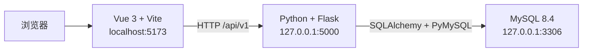

# FA Library 项目说明

## 1. 项目概述

FA Library 是一个用于维护 Failure Analysis（失效分析）案例的前后端分离项目。

系统主要功能包括：

- 展示 FA Case 列表；
- 按关键词搜索 Case；
- 新增、编辑、单条删除和批量删除；
- 分页查询；
- 统计产品分布；
- 统计各项目的 Case 数量。

当前项目目录：

```text
D:\user\yym\fa\
├── front\      Vue 3 前端
├── back\       Flask 后端
└── backend\    已创建的备用空目录，目前不使用
```

建议后续统一使用 `front` 和 `back`，避免同时使用 `back`、`backend` 两个后端目录。

## 2. 技术架构



### 前端

- Vue 3
- Vite
- JavaScript
- 原生 CSS

### 后端

- Python
- Flask
- Flask-SQLAlchemy
- Flask-Migrate
- Flask-Cors
- PyMySQL
- python-dotenv

### 数据库

- MySQL Community Server 8.4.9
- 字符集：`utf8mb4`
- 排序规则：`utf8mb4_0900_ai_ci`

## 3. MySQL 环境

MySQL 当前安装信息：

```text
安装目录：D:\MySQL\MySQL Server 8.4
数据目录：D:\MySQL\data
配置文件：D:\MySQL\my.ini
Windows 服务：MySQL84
服务地址：127.0.0.1
服务端口：3306
启动方式：Automatic
```

检查服务状态：

```powershell
Get-Service MySQL84
```

启动和停止服务（需要管理员 PowerShell）：

```powershell
Start-Service MySQL84
Stop-Service MySQL84
```

登录 MySQL：

```powershell
& "D:\MySQL\MySQL Server 8.4\bin\mysql.exe" -u root -p
```

项目数据库和推荐账户：

```text
数据库：fa_library
应用账户：fa_app
```

Flask 应使用 `fa_app` 连接数据库，不应直接使用 `root`。真实密码只能放在后端本机 `.env` 文件中，不得提交到 Git。

## 4. 数据模型

后端当前定义的表名为 `fa_cases`。

| 字段 | 类型 | 说明 |
|---|---|---|
| `id` | BIGINT | 数据库主键，自增 |
| `case_id` | VARCHAR(50) | Case 业务编号，唯一 |
| `project` | VARCHAR(100) | 项目名称 |
| `product` | VARCHAR(100) | 产品名称 |
| `technology` | VARCHAR(100) | 技术类型 |
| `fail_type` | VARCHAR(100) | 失效类型 |
| `fail_model` | VARCHAR(100) | 失效模型 |
| `created_at` | DATETIME | 创建时间 |
| `updated_at` | DATETIME | 更新时间 |

数据表由 Flask-Migrate 创建和维护，不建议同时手工修改表结构。

## 5. 后端目录结构

```text
back/
├── app/
│   ├── __init__.py
│   ├── config.py
│   ├── extensions.py
│   ├── models/
│   │   └── case.py
│   ├── routes/
│   │   ├── health.py
│   │   ├── cases.py
│   │   └── dashboard.py
│   ├── schemas/
│   │   └── case_schema.py
│   └── services/
├── tests/
├── .env.example
├── .gitignore
├── README.md
├── requirements.txt
└── run.py
```

主要职责：

- `config.py`：读取数据库和应用配置；
- `extensions.py`：初始化 SQLAlchemy、Migrate 和 CORS；
- `models/case.py`：定义 `fa_cases` 数据模型；
- `routes/cases.py`：Case CRUD 与分页接口；
- `routes/dashboard.py`：主页统计接口；
- `routes/health.py`：应用和数据库健康检查；
- `schemas/case_schema.py`：基础请求参数校验。

## 6. 后端配置与启动

进入后端目录：

```powershell
cd D:\user\yym\fa\back
```

创建虚拟环境：

```powershell
python -m venv .venv
.\.venv\Scripts\Activate.ps1
```

安装依赖：

```powershell
pip install -r requirements.txt
```

复制环境变量模板：

```powershell
Copy-Item .env.example .env
notepad .env
```

`.env` 示例：

```env
FLASK_APP=run.py
FLASK_DEBUG=true
SECRET_KEY=请替换为随机字符串
DB_HOST=127.0.0.1
DB_PORT=3306
DB_NAME=fa_library
DB_USER=fa_app
DB_PASSWORD=请填写本机数据库密码
```

注意：

- `.env` 已加入 `.gitignore`；
- 不要把真实密码填写到 `.env.example`；
- 密码包含 `@`、`#` 等字符时，后端会自动进行 URL 编码。

首次创建数据表：

```powershell
flask db init
flask db migrate -m "create fa_cases table"
flask db upgrade
```

如果 `migrations` 目录已经存在，不要再次执行 `flask db init`，只需执行：

```powershell
flask db migrate -m "描述本次模型变更"
flask db upgrade
```

启动后端：

```powershell
flask run
```

或：

```powershell
python run.py
```

默认地址：

```text
http://127.0.0.1:5000
```

检查数据库连接：

```text
GET http://127.0.0.1:5000/api/v1/health
```

正常响应：

```json
{
  "code": 0,
  "message": "success",
  "data": {
    "database": "connected"
  }
}
```

## 7. API 接口

所有接口使用 `/api/v1` 前缀。

### 7.1 健康检查

```http
GET /api/v1/health
```

### 7.2 Case 分页查询

```http
GET /api/v1/cases?page=1&page_size=10&keyword=Phoenix
```

示例响应：

```json
{
  "code": 0,
  "message": "success",
  "data": {
    "items": [],
    "pagination": {
      "page": 1,
      "page_size": 10,
      "total": 0,
      "total_pages": 0
    }
  }
}
```

### 7.3 Case 详情

```http
GET /api/v1/cases/1
```

### 7.4 新增 Case

```http
POST /api/v1/cases
Content-Type: application/json
```

```json
{
  "case_id": "C-2026-0811",
  "project": "Phoenix",
  "product": "Alpha X",
  "technology": "5G",
  "fail_type": "Performance",
  "fail_model": "FM-022"
}
```

### 7.5 修改 Case

```http
PUT /api/v1/cases/1
Content-Type: application/json
```

请求体字段与新增接口一致。

### 7.6 删除单条 Case

```http
DELETE /api/v1/cases/1
```

### 7.7 批量删除

```http
POST /api/v1/cases/batch-delete
Content-Type: application/json
```

```json
{
  "ids": [1, 2, 3]
}
```

### 7.8 首页统计

```http
GET /api/v1/dashboard/statistics
```

响应包含：

- `total_cases`：Case 总数；
- `product_distribution`：按产品统计；
- `cases_by_project`：按项目统计。

## 8. 前端目录与启动

前端目录：

```text
D:\user\yym\fa\front
```

主要文件：

```text
front/
├── src/
│   ├── api/
│   │   ├── request.js
│   │   ├── cases.js
│   │   └── dashboard.js
│   ├── App.vue
│   ├── main.js
│   └── style.css
├── index.html
├── package.json
├── pnpm-lock.yaml
└── vite.config.js
```

使用本机已配置好的 Node.js 时：

```powershell
cd D:\user\yym\fa\front
pnpm install
pnpm dev
```

如果使用 Codex 附带的 Node.js，需要先在当前 PowerShell 会话设置路径：

```powershell
$env:Path = "C:\Users\73136\.cache\codex-runtimes\codex-primary-runtime\dependencies\node\bin;C:\Users\73136\.cache\codex-runtimes\codex-primary-runtime\dependencies\bin\fallback;$env:Path"

cd D:\user\yym\fa\front
pnpm install
pnpm dev
```

默认地址：

```text
http://localhost:5173
```

生产构建：

```powershell
pnpm build
```

## 9. 前后端联调配置

开发环境已经配置为由 Vite 将 `/api` 请求代理到 Flask。

在 `vite.config.js` 中加入：

```js
export default defineConfig({
  plugins: [vue()],
  server: {
    proxy: {
      '/api': {
        target: 'http://127.0.0.1:5000',
        changeOrigin: true
      }
    }
  }
})
```

前端通过 `src/api` 目录中的请求模块统一使用相对地址调用后端：

```js
getCases({ page: 1, pageSize: 10, keyword: '' })
```

不要在 Vue 代码中保存 MySQL 地址、账户或密码，也不要让浏览器直接连接 MySQL。

当前前端 API 模块：

```text
front/src/
├── api/
│   ├── request.js       统一处理 Fetch、JSON 和接口错误
│   ├── cases.js         Case 查询、新增、修改和删除
│   └── dashboard.js     首页统计数据
└── App.vue
```

当前已经实现：

- 页面加载时从 `/api/v1/cases` 获取真实列表；
- 搜索关键词变更后进行防抖查询；
- 翻页时由后端执行分页；
- 新增和编辑弹窗调用 Flask 接口保存数据；
- 单条删除和批量删除操作 MySQL 数据；
- 产品分布和项目柱状图读取 `/api/v1/dashboard/statistics`；
- 操作完成后自动刷新表格和统计图表；
- 请求失败时显示页面错误提示。

## 10. 推荐启动顺序

### 第一个 PowerShell：确认 MySQL

```powershell
Get-Service MySQL84
```

### 第二个 PowerShell：启动 Flask

```powershell
cd D:\user\yym\fa\back
.\.venv\Scripts\python.exe -m flask run
```

### 第三个 PowerShell：启动 Vue

```powershell
cd D:\user\yym\fa\front
pnpm dev
```

最后访问：

```text
http://localhost:5173
```

## 11. 当前项目状态

已经完成：

- Figma 主页对应的 Vue 页面；
- Vue 页面响应式布局；
- MySQL 8.4 安装和 D 盘数据目录初始化；
- `fa_library` 数据库和应用账户创建；
- MySQL `MySQL84` Windows 服务注册并正常运行；
- Flask 后端项目结构；
- Python `.venv` 虚拟环境和后端依赖；
- Case 数据模型；
- 数据库迁移和 `fa_cases` 表；
- CRUD、批量删除、统计和健康检查接口；
- `/api/v1/health` 数据库连接验证；
- Case 测试数据写入及查询验证；
- Vite `/api` 代理配置；
- Vue 与 Flask/MySQL 的真实数据联调；
- 服务端搜索和分页；
- 新增、编辑、单条删除及批量删除交互；
- 产品分布饼图和项目统计柱状图动态展示；
- 前端生产构建验证。

仍需完成：

1. 完整测试新增、编辑、搜索、分页和批量删除流程；
2. 将前端页面拆分为独立组件，降低 `App.vue` 复杂度；
3. 增加后端统一异常处理和数据库事务回滚；
4. 增加后端接口自动化测试；
5. 增加更严格的前端和后端字段校验；
6. 根据业务需求扩展 Case 详情、附件和分析字段；
7. 后续如有多人使用需求，增加登录、权限和操作审计。

## 12. 常见问题

### `python`、`npm` 或 `pnpm` 无法识别

说明对应运行时没有安装或未加入当前 PowerShell 的 `PATH`。安装后需要关闭并重新打开终端。

### Flask 无法连接 MySQL

依次检查：

1. `Get-Service MySQL84` 是否显示 `Running`；
2. `.env` 中数据库名、用户名和密码是否正确；
3. `fa_app` 是否拥有 `fa_library.*` 权限；
4. MySQL 是否监听 `127.0.0.1:3306`。

### 前端接口返回 404

检查请求是否包含 `/api/v1`，并确认 Vite 代理目标为 `http://127.0.0.1:5000`。

### 浏览器出现跨域错误

开发环境优先使用 Vite 代理。后端也已通过 Flask-Cors 默认允许 `http://localhost:5173`。
